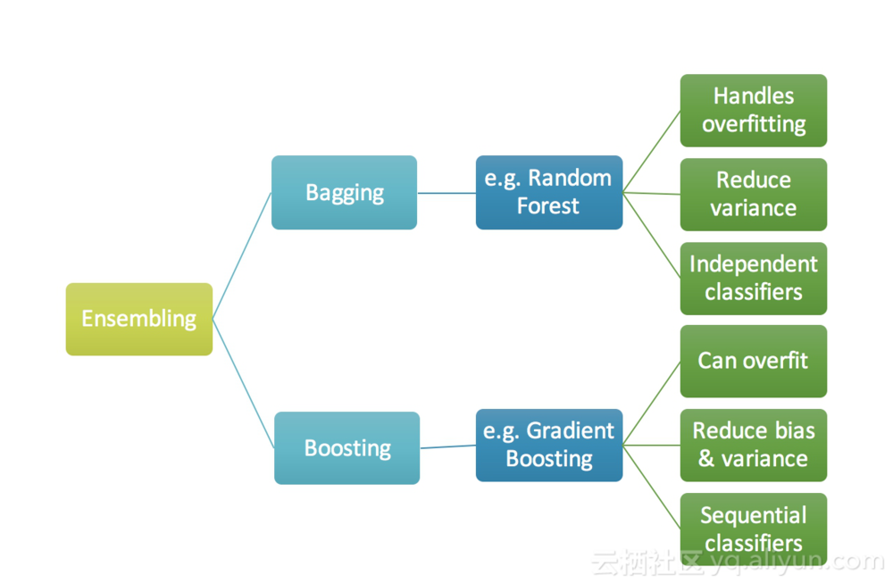
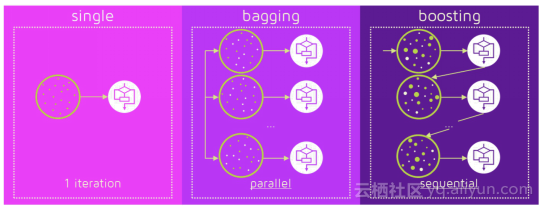

---


### 1.算法：


- **树模型背景**

   现有多数Kaggle竞赛获胜者使用各种模型的叠加/集合，但是一个特定的模式是大部分集合的部分是梯度提升（GBM）算法的一些变体。当我们试图用任何机器学习技术来预测目标变量时，实际值和预测值的主要差异是噪声，方差和偏差，集成有助于减少这些因素。集成技术进一步分为Bagging和Boosting，Bagging是一个简单的集成技术，我们建立许多独立的预测变量/模型/学习者，并使用一些模型平均技术将它们结合起来，随机森林。Boosting是一种集成技术，其中预测变量不是独立的，而是按顺序进行的，这种技术使用了后面的预测变量从之前的预测变量的错误中学习的逻辑。因此，观测值在后续模型中出现的概率是不相同的，而误差最大的出现最频繁。预测变量可以从一系列模型中选择，如决策树，回归量，分类器等等。因为新的预测变量是从以前的预测变量所犯的错误中学习的，所以需要更少的时间/次数来接近实际的预测。但是我们必须慎重选择停机判据，否则可能导致训练数据过度拟合。梯度提升是Boosting算法的一个例子。

   



- 梯度提升算法的直觉就是反复利用残差模式，加强预测能力较弱的模型，使其更好。 一旦我们达到残差没有任何模式可以建模的阶段，我们可以停止建模残差（否则可能导致过度拟合）。 在算法上，我们正在最小化我们的损失函数，使得测试损失达到最小值。假设我们将均方根误差（MSE）定义为：

  $Loss=MSE=(y_i-y_i^p)^2 \\ where \; y_i \; is \; the \;  ith \; target \\ y_i^p  \; the \; predict \\ L(y_i,y_i^p) \; is \;the \; loss ​$ 

  使我们的损失函数（MSE）最小。 通过使用梯度下降和基于学习速率更新我们的预测，我们可以找到MSE最小的值

  $y_i^p =y_i^p + \alpha * \partial \sum(y_i - y_i^p)^2 / y_i^p \\  which \; eq.  y_i^p = y_i^p -2 \alpha\sum (y_i - y_i^p)​$

  所以只需要是残差尽量小，即更新我们的预测值

- 拟合残差的步骤：

  - Â 对数据拟合一个简单的线性回归或决策树（我在我的代码中选择了决策树）[将x作为输入，将y作为输出]
  - Â 计算误差残差。实际目标值减去预测目标值[e1 = y_predicted1 - y]
  - Â 将误差残差的新模型作为具有相同输入变量的目标变量[称为e1_predicted]
  - Â 将预测的残差添加到先前的预测中[y_predicted2 = y_predicted1 + e1_predicted]
  - Â 在剩余的残差上拟合另一个模型
  - 重复上述步骤

  <https://www.jianshu.com/p/381692dec4e9>

  

##2.原理


- 梯度提升（Gradient boosting）是一种用于回归、分类和排序任务的机器学习技术，属于Boosting算法族的一部分。Boosting是一族可将弱学习器提升为强学习器的算法，属于集成学习（ensemble learning）的范畴。Boosting方法基于这样一种思想：对于一个复杂任务来说，将多个专家的判断进行适当的综合所得出的判断，要比其中任何一个专家单独的判断要好。通俗地说，就是“三个臭皮匠顶个诸葛亮”的道理。梯度提升同其他boosting方法一样，通过集成（ensemble）多个弱学习器，通常是决策树，来构建最终的预测模型。Boosting、bagging和stacking是集成学习的三种主要方法。不同于bagging方法，boosting方法通过分步迭代（stage-wise）的方式来构建模型，在迭代的每一步构建的弱学习器都是为了弥补已有模型的不足。Boosting族算法的著名代表是AdaBoost，AdaBoost算法通过给已有模型预测错误的样本更高的权重，使得先前的学习器做错的训练样本在后续受到更多的关注的方式来弥补已有模型的不足。与AdaBoost算法不同，梯度提升方法在迭代的每一步构建一个能够沿着梯度最陡的方向降低损失（steepest-descent）的学习器来弥补已有模型的不足。经典的AdaBoost算法只能处理采用指数损失函数的二分类学习任务，而梯度提升方法通过设置不同的可微损失函数可以处理各类学习任务（多分类、回归、Ranking等），应用范围大大扩展。另一方面，AdaBoost算法对异常点（outlier）比较敏感，而梯度提升算法通过引入bagging思想、加入正则项等方法能够有效地抵御训练数据中的噪音，具有更好的健壮性。这也是为什么梯度提升算法（尤其是采用决策树作为弱学习器的GBDT算法）如此流行的原因，有种观点认为GBDT是性能最好的机器学习算法，这当然有点过于激进又固步自封的味道，但通常各类机器学习算法比赛的赢家们都非常青睐GBDT算法，由此可见该算法的实力不可小觑。基于梯度提升算法的学习器叫做GBM(Gradient Boosting Machine)。理论上，GBM可以选择各种不同的学习算法作为基学习器。现实中，用得最多的基学习器是决策树。为什么梯度提升方法倾向于选择决策树（通常是CART树）作为基学习器呢？这与决策树算法自身的优点有很大的关系。决策树可以认为是if-then规则的集合，易于理解，可解释性强，预测速度快。同时，决策树算法相比于其他的算法需要更少的特征工程，比如可以不用做特征标准化，可以很好的处理字段缺失的数据，也可以不用关心特征间是否相互依赖等。决策树能够自动组合多个特征，它可以毫无压力地处理特征间的交互关系并且是非参数化的，因此你不必担心异常值或者数据是否线性可分（举个例子，决策树能轻松处理好类别A在某个特征维度x的末端，类别B在中间，然后类别A又出现在特征维度x前端的情况）。不过，单独使用决策树算法时，有容易过拟合缺点。所幸的是，通过各种方法，抑制决策树的复杂性，降低单颗决策树的拟合能力，再通过梯度提升的方法集成多个决策树，最终能够很好的解决过拟合的问题。由此可见，梯度提升方法和决策树学习算法可以互相取长补短，是一对完美的搭档。至于抑制单颗决策树的复杂度的方法有很多，比如限制树的最大深度、限制叶子节点的最少样本数量、限制节点分裂时的最少样本数量、吸收bagging的思想对训练样本采样（subsample），在学习单颗决策树时只使用一部分训练样本、借鉴随机森林的思路在学习单颗决策树时只采样一部分特征、在目标函数中添加正则项惩罚复杂的树结构等。现在主流的GBDT算法实现中这些方法基本上都有实现，因此GBDT算法的超参数还是比较多的，应用过程中需要精心调参，并用交叉验证的方法选择最佳参数。

- 先复习下监督学习的关键概念：模型（model）、参数（parameters）、目标函数（objective function 模型就是所要学习的条件概率分布或者决策函数，它决定了在给定x特征向量时如何预测出目标y。$x_i​$ 定义 为训练集中的第$i​$ 个训练样本，则线性模型（linear model）可以表示为：$\hat y_i =\sum_j w_jx_{ij} ​$。模型预测的分数在不同的任务中有不同的解释.例如在逻辑回归任务中，$1/{1+exp(-\hat y_i)}​$表示模型预测为正例的概率；而在排序学习任务中，$\hat y_i​$表示排序分。参数就是我们要从数据中学习得到的内容。模型通常是由一个参数向量决定的函数。例如，线性模型的参数可以表示为：$\Theta = \{w_j  \;  j = 1 … d\}​$  

  目标函数通常定义为如下形式：

  $$ Obj(\Theta) = L(\Theta) + \Omega(\Theta) ​$$

  其中 $L(\Theta)$  表示损失函数，用来衡量模型拟合训练数据的好坏程度；$\Omega(\Theta)$ 表示正则项，用来衡量学习到的模型的复杂度。训练集上的损失（Loss）定义为：$L=\sum_i^n l(y_i,\hat y_i )$  ; 常用的损失函数有平方损失（square loss）： $l(y_i,\hat y_i)=(y_i - \hat y_i)^2$    logsitc 损失：$l(y_i,\hat y_i ) = y_ilog\hat y_i + (1-y_i)log(1- \hat y_i)$    常用的正则项有L1范数 $\Omega = [[w]]_1$和L2范数 $[[w]]_2$ ;  Ridge regression就是指使用平方损失和L2范数正则项的线性回归模型；Lasso regression就是指使用平方损失和L1范数正则项的线性回归模型；逻辑回归（Logistic regression）指使用logistic损失和L2范数或L1范数正则项的线性模型。目标函数之所以定义为损失函数和正则项两部分，是为了尽可能平衡模型的偏差和方差（Bias Variance Trade-off）。最小化目标函数意味着同时最小化损失函数和正则项，损失函数最小化表明模型能够较好的拟合训练数据，一般也预示着模型能够较好地拟合真实数据（groud true）；另一方面，对正则项的优化鼓励算法学习到较简单的模型，简单模型一般在测试样本上的预测结果比较稳定、方差较小（奥坎姆剃刀原则）。也就是说，优化损失函数尽量使模型走出欠拟合的状态，优化正则项尽量使模型避免过拟合。

- GBDT的加法模型

  $$\hat y_i = \sum _{k=1}  f_k(x_i)  , f_k \in  F  $$  (0)

  其中为$F$所有树组成的函数空间，以回归任务为例，回归树可以看作为一个把特征向量映射为某个score的函数。该模型的参数为：$ \Theta =\{f_1,f_2,f_3,…,f_k \} $。于一般的机器学习算法不同的是，加法模型不是学习d维空间中的权重，而是直接学习函数（决策树）集合。

  上述加法模型的目标函数定义为：

  $$Obj = \sum_{i=1}^n l(y_i,\hat y_i) + \sum_k \Omega(f_k)​$$

  其中$\Omega$ 表示决策树的复杂度，那么该如何定义树的复杂度呢？比如，可以考虑树的节点数量、树的深度或者叶子节点所对应的分数的L2范数等

  如何来学习加法模型呢？解这一优化问题，可以用前向分布算法（forward stagewise algorithm）。因为学习的是加法模型，如果能够从前往后，每一步只学习一个基函数及其系数（结构），逐步逼近优化目标函数，那么就可以简化复杂度。这一学习过程称之为Boosting。具体地，我们从一个常量预测开始，每次学习一个新的函数，过程如下：

  

  $$ \hat y_i^0 = 0 \\  \hat y_i^1=  f_1(x) = \hat y_i^0 + f_1(x) \\  \hat y_i^2 = f_1(x) +  f_2(x) = \hat y_i^1  + f_2(x) \\ …  \\  \hat y_i^t = \sum_{k=1} ^t f_k(x) = \hat y_i^{t-1} + f_t(x)$$ 

  

  那么，在每一步如何决定哪一个函数被加入呢？指导原则还是最小化目标函数。

  在第步，模型对的预测为：$\hat y_i^{t-1} + f_t(x)$，其中为这一轮我们要学习的函数（决策树）$ f_t(x)$。这个时候目标函数可以写为：

  

  $$Object^t = \sum_{i=1}^n l(y_i,\hat y_i ) + \sum_k f_k  \\ = \sum_i l(y_i, \hat y_i^{t-1} + f_t) + \Omega(f_t) + constant $$   (1)

  

  举例说明，假设损失函数为平方损失（square loss），则目标函数为：

  

  $$ Object^t = \sum (y_i - \hat y_i - f_t)^2 + \Omega(f_t) + contant \\  = \sum [ 2(y_i^{t-1} - y_i) f_t(x_i) + f_t(x_i)^2]  + \Omega(f_t(x_i)) + Constant    $$ 

  

  其中，$(y_i^{t-1} - y_i)$称之为残差（residual）。因此，使用平方损失函数时，GBDT算法的每一步在生成决策树时只需要拟合前面的模型的残差.

  根据泰勒公式把函数$f(x+\Delta x)$在点处二阶展开，可得到如下等式： 

  

  $$f(x+\Delta x) = f(x) + f'(x)\Delta x  + 1/2f''(x) \Delta x^2 $$  (3)

  

  由等式(1)可知，目标函数是关于变量$\hat y_i^{t-1} + f_t$ 的函数，若把变量$ \hat y _i^{t-1}$看成是等式(3)中的x，把变量$f_t$看成是等式(3)中的 $\Delta x$，则等式(1)可转化为：

  

  $$Oject^t = \sum_i [l(y_i,\hat y_i^{t-1}) + g_i f_t + 1/2 h_i f_t^2] + \Omega(f_t) + constant  $$ (4)

  

  其中，$g_i$定义为损失函数的一阶导数$ \partial l(y_i,\hat y_t^{t-1}) / \hat y_i^{t-1}$ = $2(\hat y_i^{t-1} -y_i)$ ；$h_i$定义为损失函数的二阶导数，即$ \partial ^2l(y_i,\hat y_t^{t-1}) / \hat y_i^{t-1} = 2$。 

  由于函数中的常量在函数最小化的过程中不起作用，因此我们可以从等式(4)中移除掉常量项，得：

  

  $$Objet^t = \sum_i ^n [g_if_t + 1/2h_if_t^2] + \Omega(f_t) $$ (5)

  

  由于要学习的函数仅仅依赖于目标函数，从等式(5)可以看出只需为学习任务定义好损失函数，并为每个训练样本计算出损失函数的一阶导数和二阶导数，通过在训练样本集上最小化等式(5)即可求得每步要学习的函数$f_t(x)$，从而根据加法模型等式(0)可得最终要学习的模型

- GBDT

  一颗生成好的决策树，假设其叶子节点个数为$T$，该决策树是由所有叶子节点对应的值组成的向量 $w \in R^T$ ;以及一个把特征向量映射到叶子节点索引（Index）的函数 $q=\{ R^d \rightarrow 1…T \}$组成的 ;因此,决策树可以定义为$f_t(x) = w_{q(x)}$ 。

  决策树的复杂度可以由正则项$ \Omega(f_t(x))=\gamma T + 1/2\lambda \sum_{j=1}^T w_i^2 ​$来定义，即决策树模型的复杂度由生成的树的叶子节点数量和叶子节点对应的值向量的L2范数决定。

  定义集合$I_j = \{ i  ;\;\;  q(x_i)=j \}​$为所有被划分到叶子节点的训练样本的集合。等式(5)可以根据树的叶子节点重新组织为T个独立的二次函数的和：

  $$ \begin{align}  Objet^t  & = \sum_i ^n [g_if_t + 1/2h_if_t^2] + \Omega(f_t)  \\ & =  \sum_i ^n [g_i w_{q(x_i)} + 1/2h_iw_{q(x_i)}^2] + \gamma T + 1/2\lambda \sum_{j=1}^T w_j^2   \;  使用q(x_i)=j 替代  \\ &= \sum_{j=1}^T [(\sum_{i \in I_j}g_i)w_j + 1/2(\sum_{i \in I_j} h_i + \lambda )w_j^2 ] + \gamma T  \end{align}  $$           (6)

  定义 $G_i = \sum g_i$   ;  $H_i = \sum h_i$

  则等式(6) 可为：

  $$Object^t = \sum_{j=1}^T [G_iw_j +1/2(H_i + \lambda ) w_j^2] + \gamma T$$ 

  假设树的结构是固定的，即函数q(x)=j 确定，令函数$ Object^t $的一阶导数等于0，即可求得叶子节点对应的值为：$$w_j^* = - \frac{G_j}{H_j + \lambda }$$     (7)

  代入可得目标函数值：$$ Object^t = -1/2 \sum_j^T \frac {G_j^2}{H_j+\lambda } + \lambda T  $$        (8)

  综上，为了便于理解，单颗决策树的学习过程可以大致描述为： 
  1. 枚举所有可能的树结构q
  2. 用等式(8)为每个Obj计算其对应的分数，分数越小说明对应的树结构越好 
  3. 根据上一步的结果，找到最佳的树结构，用等式(7)为树的每个叶子节点计算预测值

  然而，可能的树结构数量是无穷的，所以实际上我们不可能枚举所有可能的树结构。通常情况下，我们采用贪心策略来生成决策树的每个节点。 

  1. 从深度为0的树开始，对每个叶节点枚举所有的可用特征 
  2. 针对每个特征，把属于该节点的训练样本根据该特征值升序排列，通过线性扫描的方式来决定该特征的最佳分裂点，并记录该特征的最大收益（采用最佳分裂点时的收益） 
  3. 选择收益最大的特征作为分裂特征，用该特征的最佳分裂点作为分裂位置，把该节点生长出左右两个新的叶节点，并为每个新节点关联对应的样本集 
  4. 回到第1步，递归执行到满足特定条件为止

  在上述算法的第二步，样本排序的时间复杂度为$O(nlogn)$，假设公用K个特征，那么生成一颗深度为K的树的时间复杂度为$O(knlogn)$。具体实现可以进一步优化计算复杂度，比如可以缓存每个特征的排序结果等。

- 如何计算每次分裂的收益呢？假设当前节点记为$C$,分裂之后左孩子节点记为$L$，右孩子节点记为$R$，则该分裂获得的收益定义为当前节点的目标函数值减去左右两个孩子节点的目标函数值之和：$Gain = Object_C - Object_L - Object_R$，具体地，根据等式(8)可得：

  $$Gain = 1/2[\frac{G_L^2}{H_L + \lambda }+\frac{G_R^2}{H_R + \lambda} - \frac{(G_L+G_R^2)}{G_L+GR+\lambda }] +\lambda T$$

  其中，$\lambda$项表示因为增加了树的复杂性（该分裂增加了一个叶子节点）带来的惩罚。等式(9)还可以用来计算输入特征的相对重要程度。

  最后，总结一下GBDT的学习算法： 
  1. 算法每次迭代生成一颗新的决策树 
  2. 在每次迭代开始之前，计算损失函数在每个训练样本点的一阶导数$g_i$和二阶导数 $h_i$
  3. 通过贪心策略生成新的决策树，通过等式(7)计算每个叶节点对应的预测值 
  4. 把新生成的决策树 $ f_t(x) ​$添加到模型$\hat y_i^t = \hat y_i^{t-1} + f_t(x)​$中：

  通常在第四步，我们把模型更新公式替换为：$\hat y_i^t = \hat y_i^{t-1} + k f_t(x)$，其中k称之为步长或者学习率。增加因子k的目的是为了避免模型过拟合。

- LightGBM

  GBDT 在每一次迭代的时候，都需要遍历整个训练数据多次。如果把整个训练数据装进内存则会限制训练数据的大小；如果不装进内存，反复地读写训练数据又会消耗非常大的时间。尤其面对工业级海量的数据，普通的 GBDT 算法是不能满足其需求的。目前已有的 GBDT 工具基本都是基于**预排序的方法（pre-sorted）**的决策树算法(如 xgboost)。这种构建决策树的算法基本思想是：

  - 首先，对所有特征都按照特征的数值进行预排序。 　　
  - 其次，在遍历分割点的时候用O(#data)的代价找到一个特征上的最好分割点。 　　
  - 最后，找到一个特征的分割点后，将数据分裂成左右子节点。 　　

  这样的预排序算法的优点是：能精确地找到分割点。

  缺点也很明显：

  - 首先，空间消耗大。这样的算法需要保存数据的特征值，还保存了特征排序的结果（例如排序后的索引，为了后续快速的计算分割点），这里需要消耗训练数据两倍的内存。 　　
  - 其次，时间上也有较大的开销，在遍历每一个分割点的时候，都需要进行分裂增益的计算，消耗的代价大。
  - 最后，对 cache 优化不友好。在预排序后，特征对梯度的访问是一种随机访问，并且不同的特征访问的顺序不一样，无法对 cache 进行优化。同时，在每一层长树的时候，需要随机访问一个行索引到叶子索引的数组，并且不同特征访问的顺序也不一样，也会造成较大的 cache miss

  LightGBM 优化部分包含以下：

  - **基于 Histogram 的决策树算法**
  - **带深度限制的 Leaf-wise 的叶子生长策略**
  - **直方图做差加速**
  - **直接支持类别特征(Categorical Feature)**
  - **Cache 命中率优化**
  - **基于直方图的稀疏特征优化**
  - **多线程优化**

  1. 使用直方图算法有很多优点。首先，最明显就是内存消耗的降低，直方图算法不仅不需要额外存储预排序的结果，而且可以只保存特征离散化后的值，而这个值一般用 8 位整型存储就足够了，内存消耗可以降低为原来的1/8

     

  2. 带深度限制的 **Leaf-wise** 的叶子生长策略 抛弃了大多数 GBDT 工具使用的按层生长 (level-wise) 的决策树生长策略，而使用了带有深度限制的按叶子生长 (leaf-wise) 算法。Level-wise 过一次数据可以同时分裂同一层的叶子，容易进行多线程优化，也好控制模型复杂度，不容易过拟合。但实际上 Level-wise 是一种低效的算法，因为它不加区分的对待同一层的叶子，带来了很多没必要的开销，因为实际上很多叶子的分裂增益较低，没必要进行搜索和分裂，只分裂增益最大的一个叶子。

     

  3. Histogram（直方图）做差加速，通常构造直方图，需要遍历该叶子上的所有数据，但直方图做差仅需遍历直方图的k个桶。利用这个方法，LightGBM 可以在构造一个叶子的直方图后，可以用非常微小的代价得到它兄弟叶子的直方图，在速度上可以提升1倍

     

  4. 直接支持类别特征，可以直接输入类别特征，不需要额外的0/1 展开。并在决策树算法上增加了类别特征的决策规则。

  5. LightGBM并行优化，支持**特征并行**和**数据并行**的两种

     - 特征并行的主要思想是在不同机器在不同的特征集合上分别寻找最优的分割点，然后在机器间同步最优的分割点。

       传统的特征并行算法根据不同的特征子集，将数据集进行垂直切分。（不同机器worker有不同的特征子集）每个worker寻找局部的最优分裂特征以及分裂点。不同worker之间进行网络传输，交换最优分裂信息，最终得到最优的分裂信息。具有最优分裂特征的worker，局部进行分裂，并将分裂结果广播到其他worker。其他worker根据接收到的数据进行切分数据。该方法不能有效地加速特征选择的效率，当数据量#data很大时，该并行方法不能加快效率。并且，最优的分裂结果需要在worker之间进行传输，需要消耗很多的传输资源以及传输时间。

       

     - 在数据并行中使用分散规约 (Reduce scatter) 把直方图合并的任务分摊到不同的机器，降低通信和计算，并利用直方图做差，进一步减少了一半的通信量。有点像reduce任务，现在本地reduce，然后在节点之间reduce。

       

       

     - 在数据量很大的时候，使用投票并行可以得到非常好的加速效果。

       


### 3.代码

- **二分类**

  ```python
  import lightgbm as lgb  
  import pandas as pd  
  import numpy as np  
  import pickle  
  from sklearn.metrics import roc_auc_score  
  from sklearn.model_selection import train_test_split  
  
  print("Loading Data ... ")  
  
  # 导入数据  
  train_x, train_y, test_x = load_data()  
  
  # 用sklearn.cross_validation进行训练数据集划分，这里训练集和交叉验证集比例为7：3，可以自己根据需要设置  
  X, val_X, y, val_y = train_test_split(  
      train_x,  
      train_y,  
      test_size=0.05,  
      random_state=1,  
      stratify=train_y # 这里保证分割后y的比例分布与原数据一致  
  )  
  
  X_train = X  
  y_train = y  
  X_test = val_X  
  y_test = val_y  
  
  # create dataset for lightgbm  
  lgb_train = lgb.Dataset(X_train, y_train)  
  lgb_eval = lgb.Dataset(X_test, y_test, reference=lgb_train)  
  # specify your configurations as a dict  
  params = {  
      'boosting_type': 'gbdt',  
      'objective': 'binary',  
      'metric': {'binary_logloss', 'auc'},  #二进制对数损失
      'num_leaves': 5,  
      'max_depth': 6,  
      'min_data_in_leaf': 450,  
      'learning_rate': 0.1,  
      'feature_fraction': 0.9,  
      'bagging_fraction': 0.95,  
      'bagging_freq': 5,  
      'lambda_l1': 1,    
      'lambda_l2': 0.001,  # 越小l2正则程度越高  
      'min_gain_to_split': 0.2,  
      'verbose': 5,  
      'is_unbalance': True  
  }  
  
  # train  
  print('Start training...')  
  gbm = lgb.train(params,  
                  lgb_train,  
                  num_boost_round=10000,  
                  valid_sets=lgb_eval,  
                  early_stopping_rounds=500)  
  
  print('Start predicting...')  
  
  preds = gbm.predict(test_x, num_iteration=gbm.best_iteration)  # 输出的是概率结果  
  
  # 导出结果  
  threshold = 0.5  
  for pred in preds:  
      result = 1 if pred > threshold else 0  
  
  # 导出特征重要性  
  importance = gbm.feature_importance()  
  names = gbm.feature_name()  
  with open('./feature_importance.txt', 'w+') as file:  
      for index, im in enumerate(importance):  
          string = names[index] + ', ' + str(im) + '\n'  
          file.write(string)  
  ```

  

- **多分类**

  ```python
  import lightgbm as lgb  
  import pandas as pd  
  import numpy as np  
  import pickle  
  from sklearn.metrics import roc_auc_score  
  from sklearn.model_selection import train_test_split  
  
  print("Loading Data ... ")  
  
  # 导入数据  
  train_x, train_y, test_x = load_data()  
  
  # 用sklearn.cross_validation进行训练数据集划分，这里训练集和交叉验证集比例为7：3，可以自己根据需要设置  
  X, val_X, y, val_y = train_test_split(  
      train_x,  
      train_y,  
      test_size=0.05,  
      random_state=1,  
      stratify=train_y ## 这里保证分割后y的比例分布与原数据一致  
  )  
  
  X_train = X  
  y_train = y  
  X_test = val_X  
  y_test = val_y  
  
  
  # create dataset for lightgbm  
  lgb_train = lgb.Dataset(X_train, y_train)  
  lgb_eval = lgb.Dataset(X_test, y_test, reference=lgb_train)  
  # specify your configurations as a dict  
  params = {  
      'boosting_type': 'gbdt',  
      'objective': 'multiclass',  
      'num_class': 9,  
      'metric': 'multi_error',  
      'num_leaves': 300,  
      'min_data_in_leaf': 100,  
      'learning_rate': 0.01,  
      'feature_fraction': 0.8,  
      'bagging_fraction': 0.8,  
      'bagging_freq': 5,  
      'lambda_l1': 0.4,  
      'lambda_l2': 0.5,  
      'min_gain_to_split': 0.2,  
      'verbose': 5,  
      'is_unbalance': True  
  }  
  
  # train  
  print('Start training...')  
  gbm = lgb.train(params,  
                  lgb_train,  
                  num_boost_round=10000,  
                  valid_sets=lgb_eval,  
                  early_stopping_rounds=500)  
  
  print('Start predicting...')  
  
  preds = gbm.predict(test_x, num_iteration=gbm.best_iteration)  # 输出的是概率结果  
  
  # 导出结果  
  for pred in preds:  
      result = prediction = int(np.argmax(pred))  
  
  # 导出特征重要性  
  importance = gbm.feature_importance()  
  names = gbm.feature_name()  
  with open('./feature_importance.txt', 'w+') as file:  
      for index, im in enumerate(importance):  
          string = names[index] + ', ' + str(im) + '\n'  
          file.write(string) 
  ```

  

